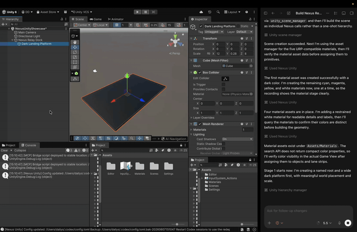

# Nexus Unity

[](https://github.com/ForkHorizon/NexusUnity/releases/tag/v1.3.0)
[](LICENSE.md)
[](package.json)
[](https://github.com/ForkHorizon/NexusUnity/actions/workflows/validate.yml)

Nexus Unity is an open source Unity Editor automation package. It runs a local JSON-RPC server inside the Unity Editor and exposes scene, asset, code, log, test, inspection, and UI automation tools to trusted local developer workflows.

- Package id: `com.forkhorizon.nexus.unity`
- Version: `1.3.0`
- License: `GPL-3.0-only`
- Public repository: `https://github.com/ForkHorizon/NexusUnity.git`

## Status

Active public release. Current version: `1.3.0`.

The public API is maintained for local Unity Editor automation workflows, while new tools and bridge improvements are tracked under `[Unreleased]` in `CHANGELOG.md` until the next tagged release.

## Screenshot / Demo

<table>
  <tr>
    <td width="50%">
      <a href="https://www.youtube.com/watch?v=zapydBzRzkE">
        
      </a>
      <br>
      <sub>8-second README preview</sub>
    </td>
    <td width="50%">
      <a href="https://www.youtube.com/watch?v=zapydBzRzkE">
        
      </a>
      <br>
      <sub>Watch the full Nexus Unity demo on YouTube</sub>
    </td>
  </tr>
</table>

Open `Window > Nexus Unity` in the Unity Editor to use the server, integrations, resources, and settings tabs. The demo shows an AI agent using Nexus Unity to create a scene, inspect editor feedback, generate code, and iterate inside the Unity Editor.

## Requirements

- Unity `6000.0` or newer.
- Local machine access to the Unity Editor.
- Python 3 for MCP bridge integrations.

## Install

1. Open your Unity project.
2. Go to `Window > Package Manager`.
3. Click `+` and select `Add package from git URL...`.
4. Enter:

```text
https://github.com/ForkHorizon/NexusUnity.git
```

For reproducible installs, pin the public release tag:

```text
https://github.com/ForkHorizon/NexusUnity.git#v1.3.0
```

## Start The Server

1. Open `Window > Nexus Unity`.
2. Click `Start Server`.
3. Confirm the server is listening on the configured loopback port, usually:

```text
http://127.0.0.1:8081/
```

The server is intended for trusted local automation only. It validates loopback hosts and browser origins, constrains file operations to the Unity project root, and limits request payload size.

## Editor Menu

Nexus Unity uses a single Unity menu entry: `Window > Nexus Unity`.

- `Server`: start, stop, restart, copy the local URL, and deploy the MCP bridge to the project root.
- `Integrations`: configure Codex, Claude Desktop, Gemini, Antigravity, Cursor, VS Code/Cline/Roo, Windsurf, or a generic MCP JSON client.
- `Resources`: open docs, API reference, changelog, and the package folder.
- `Settings`: choose how much Nexus Unity service logging is written to the Unity Console.

Diagnostic actions such as the UI test window, log verification, Codex link test, project audit, and API verification are available from the collapsed `Advanced / Diagnostics` block in `Resources`. The default tabs show only user-facing setup and server actions. Server and bridge blocks stay stacked vertically, while their action rows and the integration cards stretch and wrap cleanly across narrow and wide editor windows.

Console logging defaults to `Important`, which shows key lifecycle/setup messages plus warnings and errors. Use `Settings` or `Edit > Project Settings > Nexus Unity` to switch to `All` for full diagnostics or `Custom` to show info logs only for selected Nexus Unity categories.

## Public APIs

Nexus Unity supports two public surfaces:

- Raw HTTP JSON-RPC tools: unprefixed Unity method names returned by `list_tools`.
- MCP bridge tools: consolidated `unity_` manager tools optimized for AI clients.

Direct JSON-RPC example:

```bash
curl -s http://127.0.0.1:8081/ \
  -H 'Content-Type: application/json' \
  -d '{"jsonrpc":"2.0","method":"get_server_status","params":{},"id":1}'
```

MCP clients should use the Python bridge:

```bash
python3 Packages/com.forkhorizon.nexus.unity/Editor/nexus_unity_bridge.py
```

The Unity window can also deploy the bridge to the project root for CLIs that prefer stable local paths. The deployment copies both `nexus_unity_bridge.py` and the required `nexus_bridge/` module.

## AI Client Setup

For Codex, Claude Desktop, Gemini, Antigravity, Cursor, VS Code/Cline/Roo, Windsurf, or compatible MCP clients, open `Window > Nexus Unity` and use the `Integrations` tab.

Each integration card shows `Detected`, `Not found`, `Configured`, `Outdated`, or `Error` status and provides:

- `Auto Setup` when Nexus Unity can safely write or invoke the client configuration.
- `Copy Config` for manual setup.
- `Open Config` when the client uses a known config file path.

Nexus Unity generates configs from the current `python3` path and deployed `nexus_unity_bridge.py` path. User/global config writes create a timestamped backup before modifying an existing file.

`Outdated` means the client config points at a different Unity project, the project-root bridge has not been deployed, or the deployed bridge version differs from the package bridge version. Run `Auto Setup`, then restart the affected MCP client session so it loads the current bridge.

Package path:

```json
{
  "mcpServers": {
    "nexus-unity": {
      "command": "python3",
      "args": ["Packages/com.forkhorizon.nexus.unity/Editor/nexus_unity_bridge.py"]
    }
  }
}
```

Root-deployed path:

```json
{
  "mcpServers": {
    "nexus-unity": {
      "command": "python3",
      "args": ["nexus_unity_bridge.py"]
    }
  }
}
```

## Key Tools

- `unity_write_and_compile`: write files, wait for Unity reload, and return compiler errors.
- `unity_scene_manager`: create, open, save, and list scenes, including raw-action aliases like `list_scenes`.
- `unity_hierarchy_manager`: create, rename, transform, destroy, duplicate, activate, parent, and batch-build GameObjects.
- `unity_component_manager`: add, inspect, update, and remove components.
- `unity_asset_manager`: search, import, refresh, and manage prefab assets.
- `unity_editor_controller`: play mode, menus, undo/redo, logs, editor state, asset refresh, and test-result polling.
- `unity_ui_automation`: query and operate Unity Editor UI Toolkit windows, including window rects for resize QA.

See `API_REFERENCE.MD` for the complete raw and MCP tool catalogs.

## Compatibility Notes

Current development keeps the public API backward-compatible while tightening schemas and documentation:

- Use `unity_write_and_compile` for code-edit workflows. Older references to `unity_apply_code_change` are outdated and should not be used for the public MCP bridge.
- `update_component` accepts the preferred `properties` object and the legacy `json_data` string form.
- `unity_scene_manager` accepts obvious aliases such as `list_scenes`, `create_scene`, `open_scene`, and `save_scene`; invalid manager actions now report the valid action names.
- `create_scene` accepts optional `path` and `open_if_exists` so agents can create or reopen a deterministic scene asset in one call.
- `create_primitive` accepts optional `name`, `parent_id`, `position`, `rotation`, `scale`, and `material_path`, which lets agents build visible non-origin objects without fragile follow-up calls.
- `set_transform` updates position, rotation, and scale.
- `create_material` accepts optional `path`, `base_color` / `color`, and `emission_color` so generated materials can be created inside a chosen project folder and made visibly distinct.
- `write_file` and `write_files_batch` create missing parent directories after path validation.
- `invoke_method.arguments` is an optional positional JSON array.
- `click_object_in_game` accepts a documented `instance_id` target and still supports hierarchy `path` lookup.
- Unity 6.x editor identity differences are handled internally: Nexus keeps JSON `instance_id` values stable while using Unity 6.4+ `EntityId` APIs when available and Unity 6.3-compatible instance ID APIs otherwise.
- `get_test_results` reads Unity `TestResults*.xml` summaries from the project root or Unity persistent data path; `unity_editor_controller` exposes `run_tests_wait` as a bridge-side polling workflow.
- `get_tool_usage_stats` reports in-memory raw tool counts, durations, and errors since Unity domain load without storing request payloads; `reset_tool_usage_stats` clears that state for scoped diagnostics. Both are also available through `unity_editor_controller`.
- `ui_get_window_rect`, `ui_set_window_rect`, and `ui_capture_window_snapshot` support automated layout checks for editor windows.

## Documentation

| Document | Purpose |
|---|---|
| `DOCUMENTATION.MD` | Architecture, setup, security, bridge deployment, and troubleshooting |
| `API_REFERENCE.MD` | Raw JSON-RPC and MCP bridge tool catalogs |
| `SECURITY.md` | Supported versions, vulnerability reporting, and local-only security policy |
| `CONTRIBUTING.md` | Contribution rules and validation expectations |
| `CODE_OF_CONDUCT.md` | Community behavior expectations |
| `RELEASE.md` | Public release checklist and smoke test |
| `CHANGELOG.md` | Public release history |
| `LICENSE.md` | GPL-3.0-only license text |

## Contributor Validation

GitHub Actions is the required validation gate for public contributions. The `Validate package` workflow runs on a maintainer-owned self-hosted Mac runner instead of GitHub-hosted runners. Maintainers should configure the `PR target policy`, `Static validation`, `Documentation quality AI`, and `Unity package smoke` jobs as required status checks before merge.

Static validation includes `NexusQualityGate`, a Roslyn-based checker for production C# source under `Editor/` and `Runtime/`. It blocks missing XML documentation on public/protected types and methods, generic filler summaries, files over 450 lines, and methods over 150 lines. Files over 300 lines and methods over 50 lines are reported as warnings so contributors can split code before it becomes hard to review.

The runner must have the labels `self-hosted`, `macOS`, `ARM64`, and `nexus-unity-ci`; the AI review job also requires `nexus-doc-ai`. The local toolchain must provide `python3`, `dotnet`, Unity `6000.4.3f1`, and Ollama on `http://127.0.0.1:11434`. The workflow uses GitHub Actions `concurrency` group `nexus-unity-ci` with `queue: max`, so multiple trusted runs wait in order instead of competing for the MacBook.

The required `Documentation quality AI` job also runs checklist quality review. It sends documentation/code excerpts to local Ollama and verifies that XML comments match the implementation intent, major caller-visible side effects, and Unity Editor behavior. It reviews each pull request checklist item individually against repository evidence, CI wiring, safety policies, and tracked files, then emits a specific next action when a checklist item is not satisfied. The AI rubric is intentionally pragmatic: it blocks misleading or filler docs and clear checklist violations, not comments that omit every private implementation detail or runtime evidence that is supplied by another CI job. The job sets a short Ollama `keep_alive` and unloads the model after every run so large local models do not remain in memory between checks.

Contributor pull requests should target `development`. The `main` branch is release-only and should be updated only by maintainers during release preparation.

Direct pushes to `main` and `development` are blocked for everyone. Trusted maintainers merge pull requests in GitHub. Because self-hosted runners in public repositories must not execute untrusted fork code, external fork pull requests fail the local CI policy check with a clear message; a maintainer reviews the patch and replays it through a trusted branch before full CI runs on the Mac runner.

Contributors can also install the optional local pre-push hook for faster feedback:

```bash
bash scripts/install-git-hooks.sh
```

The hook runs `scripts/prepush-validate.sh --quick`, which is designed to finish in under a minute on normal contributor machines. It always runs static package validation and uses `NEXUS_UNITY_HOOK_LIVE=auto` by default: when the Unity server is reachable, the hook adds a short read-only live smoke check for the public raw tool catalog and key schemas; when the server is temporarily unreachable, it prints `NOTICE` and lets the push continue.

Live smoke behavior can be made explicit:

```bash
NEXUS_UNITY_HOOK_LIVE=off bash scripts/prepush-validate.sh --quick
NEXUS_UNITY_HOOK_LIVE=required bash scripts/prepush-validate.sh --quick
```

Full local integration validation is opt-in:

```bash
bash scripts/prepush-validate.sh --integration
```

Maintainers can run the required local AI documentation gate with:

```bash
NEXUS_DOC_AI_MODEL=<ollama-model> bash scripts/prepush-validate.sh --quality-ai
```

`NEXUS_DOC_AI_KEEP_ALIVE` controls how long Ollama may keep the model warm between review requests and defaults to `30s`. `NEXUS_DOC_AI_UNLOAD_ON_EXIT=true` is the default and sends an explicit unload request when the review finishes.

Maintainers and agents can also run the optional focused tooling smoke:

```bash
python3 scripts/agent-tooling-smoke.py
```

For integration tests, open the Unity project, start the Nexus Unity server from `Window > Nexus Unity`, and set `NEXUS_UNITY_PROJECT_ROOT` if the package is not checked out under a Unity project.

## Development Versioning

Do not bump `package.json` for every change while development is unreleased. Keep the package at the latest public release version, currently `1.3.0`, and record user-visible work under `[Unreleased]` in `CHANGELOG.md`.

When maintainers prepare a release, move the accumulated `[Unreleased]` entries to the new version section, update `package.json` and the visible version strings in `README.md`, `DOCUMENTATION.MD`, and `API_REFERENCE.MD`, then tag the release. Unity Package Manager and GitHub releases both use semantic `MAJOR.MINOR.PATCH` versions such as `1.3.0` and `v1.3.0`. Reserve patch bumps for urgent compatible hotfixes.

## Community

Please use GitHub Issues for reproducible bugs and focused feature requests. Security reports should follow `SECURITY.md` and use GitHub Security Advisories rather than public issues.

To support ongoing development, use the repository Sponsor button configured through GitHub Sponsors.

## Release Notes

The `1.3.0` release improves integration drift detection, clarifies bridge redeploy restart guidance, and restores Unity 6.3 editor compilation while keeping Unity 6.4 object identity support.

The `1.2.0` release improves AI-driven scene building through manager aliases, richer primitive/material/transform actions, clearer invalid-action recovery, and stricter local/CI validation including checklist AI review and Unity package smoke tests.

The `1.1.2` hotfix repairs clean Unity Package Manager installs by keeping package-internal tests out of normal user compilation and declaring the required Input System dependency. If you installed `v1.1.0` or `v1.1.1`, update the pinned Git URL to `#v1.1.2` or newer and let Unity refresh PackageCache. If Unity keeps stale errors, close Unity, delete the old `Library/PackageCache/com.forkhorizon.nexus.unity@...` folder from the affected project, and reopen the project.

The `1.1.1` hotfix added a runtime assembly definition and removed Unity `.meta` files from the ignored `tools~/` folder.

The `1.1.0` release adds the public contribution validation gate, self-hosted AI documentation review, compact Nexus Unity editor UI, integration setup improvements, raw agent diagnostics, bridge polling actions, UI automation diagnostics, and console logging controls.

The original `1.0.0` open source release ships the Python bridge as the supported MCP bridge. Experimental native bridge artifacts are not included.
